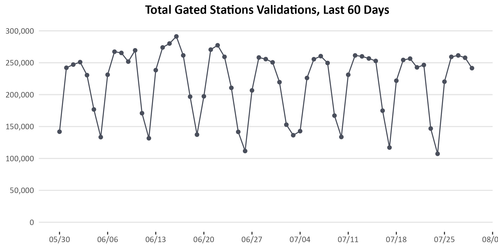

```{r setup, include=FALSE}
library(tidyverse)
library(here)
library(readxl)
library(xlsx)
library(openxlsx)
library(lubridate)
library(ggplot2)
library(extrafont)
library(plyr)
library(dplyr)
library(jpeg)
# library(officer)
loadfonts(device = "win")
options(scipen = 999)

```


```{r, echo=F, message=F, error=F, warning=F}
gated_line <- read.csv("C:/Users/Willis-JacksonM/Box/Ongoing Activities/Ridership/COVID-specific Work/downloadable data for public/CSVs for public download/2022.08.10 MBTA Gated Station Validations by line 2018-22.csv") %>%
  mutate(servicedate = mdy(servicedate))

gated_baselines <- read_excel("gated_line_summary.xlsx", sheet = "Baselines") %>%
  filter(month == month(max(gated_line$servicedate)))

gated_station <- read.csv("C:/Users/Willis-JacksonM/Box/Ongoing Activities/Ridership/COVID-specific Work/downloadable data for public/CSVs for public download/2022.08.10 MBTA Gated Station Validations by station 2018-22.csv")


```


```{r, echo=F, message=F, error=F, warning=F}
wk_end <- Sys.Date() - wday(Sys.Date() + 1) - 7  # for current data remove this minus 7, consider just manually typing the date here
wk_start <- Sys.Date() - wday(Sys.Date() + 5) - 14   # for current data remove this minus 7

baselines <- gated_baselines %>%
  pivot_wider(names_from = "route_or_line",
              id_cols = "month",
              values_from = "avg_validations") %>%
  mutate(`Total Gated Stations` = `Blue Line` + `Green Line` + `Red Line` + `Orange Line` + `Silver Line`,
         month = "baseline")

# update the Daily One-Page Update
line_summary <- gated_line %>%
  pivot_wider(names_from = "route_or_line", 
              id_cols = "servicedate", values_from = "validations") %>%
  mutate(`Total Gated Stations` = `Blue Line` + `Green Line` + `Red Line` + `Orange Line` + `Silver Line`) %>%
  filter(servicedate >= mdy("3-16-2020"))

current_week <- line_summary %>%
  filter(servicedate <= wk_end & servicedate >= wk_start) %>%
  summarise(`Blue Line` = mean(`Blue Line`),
            `Green Line` = mean(`Green Line`),
            `Orange Line` = mean(`Orange Line`),
            `Red Line` = mean(`Red Line`),
            `Silver Line` = mean(`Silver Line`),
            `Total Gated Stations` = mean(`Total Gated Stations`)) %>%
  mutate(month = "current") %>%
  rbind(baselines) %>%
  pivot_longer(cols = c("Blue Line","Green Line","Orange Line","Red Line","Silver Line","Total Gated Stations" ),
               names_to = "Line") %>%
  pivot_wider(names_from = "month",
              id_cols = "Line",
              values_from = "value") %>%
  mutate(pct_decrease = (current-baseline)/baseline)


gated_chart <- gated_line %>%
  pivot_wider(names_from = "route_or_line", 
              id_cols = "servicedate", values_from = "validations") %>%
  mutate(`Total Gated Stations` = `Blue Line` + `Green Line` + `Red Line` + `Orange Line` + `Silver Line`) %>%
  filter(servicedate <= wk_end & servicedate >= (wk_end-60))


wb <- loadWorkbook("gated_line_summary.xlsx")
writeData(wb, sheet = "Line Summary", x = line_summary, startRow = 3, colNames = F)
writeData(wb, sheet = "60-days", x = gated_chart)
saveWorkbook(wb, 
             paste("C:/Users/Willis-JacksonM/Box/Ongoing Activities/Ridership/COVID-specific Work/Weekly Updates/Daily One-Page Update ", 
                   format(Sys.Date()-6,"%Y.%m.%d"), ".xlsx", sep = ""), 
             overwrite = T)


```


```{r, echo=F, message=F, error=F, warning=F}

# colors for MBTA
# opmi_rl = "#DA291C",
#     opmi_ol = "#ED8B00",
#     opmi_gl = "#00843D",
#     opmi_bl = "#003DA5",
#     opmi_bus = "#FFC72C",
#     opmi_ferry = "#008EAA",
#     opmi_cr = "#80276C",
#     opmi_sl = "#7C878E",
#     opmi_ride = "#52BBc5",
#     opmi_subway = "#4A4F5C"


gated_station_chart <- function(data = "gated_chart", servicedate = "servicedate", line){
  
  seq_max <- ifelse(line == "Red Line",
                    120000,
             ifelse(line == "Orange Line",
                    100000,
             ifelse(line == "Blue Line",
                    40000,
             ifelse(line == "Green Line",
                    60000,
             ifelse(line == "Total Gated Stations",
                    300000)))))
  
  seq_by  <- ifelse(line == "Red Line",
                    20000,
             ifelse(line == "Orange Line",
                    20000,
             ifelse(line == "Blue Line",
                    5000,
             ifelse(line == "Green Line",
                    10000,
             ifelse(line == "Total Gated Stations",
                    50000)))))
  
  ggplot(data) +
  geom_line(aes(x = servicedate,
                y = .data[[line]]), 
            color = ifelse(line == "Red Line",
                           "#DA291C",
                    ifelse(line == "Orange Line",
                           "#ED8B00",
                    ifelse(line == "Green Line",
                           "#00843D",
                    ifelse(line == "Blue Line",
                           "#003DA5", "#4A4F5C"))))) +
  geom_point(aes(x = servicedate,
                 y = .data[[line]]), 
            color = ifelse(line == "Red Line",
                           "#DA291C",
                    ifelse(line == "Orange Line",
                           "#ED8B00",
                    ifelse(line == "Green Line",
                           "#00843D",
                    ifelse(line == "Blue Line",
                           "#003DA5", "#4A4F5C"))))) +
  scale_x_date(name = NULL,
               date_labels = "%m/%d",
               date_breaks = "1 week",
               limits = c(min(data[[servicedate]]),max(data[[servicedate]])-1)) +
  scale_y_continuous(name = NULL,
                     breaks = brks <- seq(0, 
                                          seq_max, by = seq_by),
                     labels = paste(prettyNum(brks, big.mark = ",")),
                     limits = c(0, max(brks))) +
  labs(title = paste(ifelse(line == "Total Gated Stations","","Total"),line,"Validations, Last 60 Days")) +
  theme(text = element_text(family = "Calibri"),
        panel.background = element_blank(), 
        panel.grid.major.y = element_line(color = "grey89"),
        panel.grid.major.x = element_blank(),
        axis.ticks.y = element_blank(), plot.title = element_text(hjust = .5, face = "bold"))

ggsave(paste(line,".jpg", sep = ""), height = 3.5, width = 7)
knitr::include_graphics(paste(line,".jpg",sep = ""))


  
}


```


# Gated Rapid Transit Stations


```{r, echo=F, message=F, error=F, warning=F}
gated_station_chart(gated_chart, line = "Total Gated Stations")

# 

```


# Gated Rapid Transit Stations (Detail)

```{r, echo=F, message=F, error=F, warning=F}

gated_station_chart(gated_chart, line = "Red Line")
gated_station_chart(gated_chart, line = "Orange Line")
gated_station_chart(gated_chart, line = "Blue Line")
gated_station_chart(gated_chart, line = "Green Line")


```


# Bus Ridership


```{r, echo=F, message=F, error=F, warning=F}
bus_raw <- read_excel("C:/Users/Willis-JacksonM/Box/Ongoing Activities/Ridership/COVID-specific Work/bus updates/Daily bus ridership_v4_080922 (1).xlsx", 
                      sheet = "Weekly_RteRiders_Output", skip = 4) %>%
  .[,1:13] %>%
  mutate(temp = case_when(`Adjusted Riders` == "N/A" ~ 999999,
                          `Adjusted Riders` != "N/A" ~ round_any(as.numeric(`Adjusted Riders`),accuracy = 1, f = round)),
         WeekStartDay = format(as.Date(ymd(WeekStartDay)), format = "%d-%m-%Y")) %>%
  arrange(ROUTE) %>%
  select(WeekStartDay, avl_routes, temp) %>%
  pivot_wider(id_cols = avl_routes, names_from = WeekStartDay, values_from = temp) %>%
  dplyr::rename(Route = avl_routes)

wb <- loadWorkbook("bus_template.xlsx")
writeData(wb, sheet = "Ridership by Route", x = bus_raw, startRow = 3)
saveWorkbook(wb, "C:/Users/Willis-JacksonM/Box/Ongoing Activities/Ridership/COVID-specific Work/downloadable data for public/Weekly Bus Ridership Prep Files/Old Files/Weekly_Bus_Ridership_by_Route_2022.08.10.xlsx", overwrite = T)
#need to replace 999999 with 'N/A' after exporting to Excel


```


